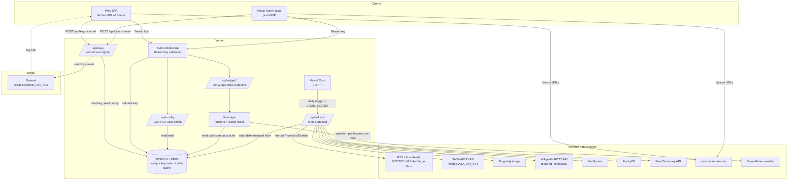
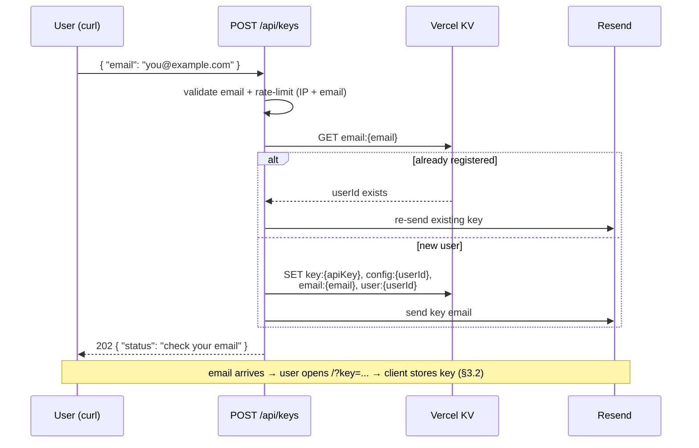
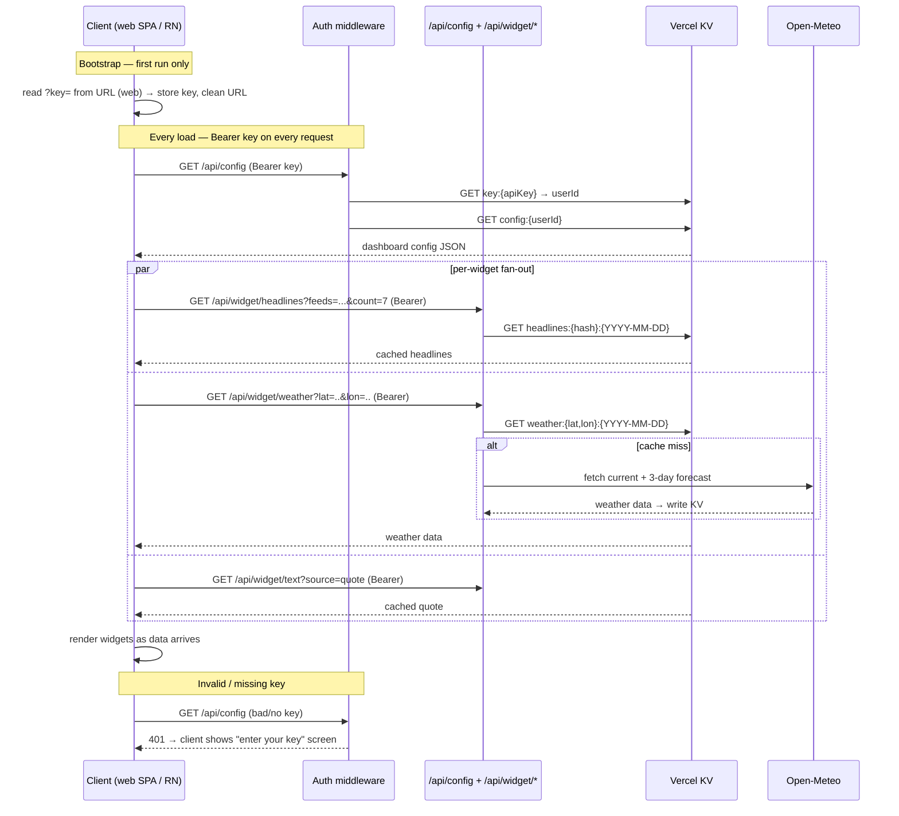

# frontdoor — Architecture

This document describes the runtime architecture of frontdoor: the services it
integrates with, how a page load flows through the system, and how data is cached.

For the *why* behind the design (the layout philosophy, the aesthetic, the widget
specs), see [`design/`](../design). For the original build-vs-rewrite mapping, see
[`design/06-architecture.md`](../design/06-architecture.md). This doc is the
consolidated, current view.

> **⚠️ Divergence from the spec.** The design docs (`02-aesthetic-and-rendering.md`,
> `06-architecture.md`) describe a server-rendered "static document" with near-zero
> client JS and *no client-side data fetching*. This architecture **consciously
> overrides that**: frontdoor is built as a **client SPA + JSON API**, so the same API
> can back React Native iOS/Android apps post-MVP. The cost is the original
> "zero-framework-feel" IP — loading states, hydration, and client-side fetching are
> now in scope. This was a deliberate product decision; the spec's anti-goals on this
> point no longer hold.

---

## 1. Overview

frontdoor is a **client SPA + JSON API**, both hosted on Vercel. The web frontend and
(post-MVP) React Native apps are **peer clients** of one API — they fetch config and
widget data over HTTP with a Bearer token. Content is still fetched from upstream
sources server-side and cached daily; clients never call third-party APIs directly.

There are four tiers of services:

1. **Platform** — the Vercel ecosystem (hosting, serverless API routes, KV store, cron).
2. **External data sources** — keyless content APIs and RSS feeds, fetched server-side
   by the API layer.
3. **Auth & signup** — a hand-rolled per-user API-key scheme (no third-party identity
   provider); self-service signup via a `curl`-able endpoint, with the key delivered by
   email through **Resend**.
4. **Clients** — the web SPA today; React Native iOS/Android apps post-MVP. All consume
   the same API.

There is **no relational database** in v1. Vercel KV (Redis) holds everything: user
config, the API-key index, and the daily content cache.

---

## 2. System diagram



---

## 3. Request flow

### 3.1 Signup — `POST /api/keys`

Self-service: a user `curl`s the endpoint with an email; the key is minted, the default
config is seeded, and the key is delivered by email via Resend. The HTTP response
**never contains the key** (so it can't be harvested by hammering the endpoint), and the
call is **idempotent** — re-signing-up with the same email re-sends the existing key.



### 3.2 Page load

The SPA shell loads first (static assets, no user data), reads the stored API key,
fetches the user's config, then fans out to the per-widget endpoints. Each widget shows
a quiet loading state until its data arrives. React Native apps follow the identical
sequence — they are peer clients of the same endpoints.



---

## 4. Service integrations

### Platform (Vercel)

| Service | Role |
|---------|------|
| **Vercel** | Hosting (static SPA assets + serverless API routes), CDN edge cache |
| **Vercel KV** (Redis) | Single source of truth — user config, API-key index, daily content cache |
| **Vercel Cron** | Triggers `/api/refresh` daily at `0 3 * * *` |
| **Vercel Edge / CDN** | Caches public widget-endpoint responses via `s-maxage` (see §5) |

### External data sources

All are fetched **server-side only** and sent with `User-Agent: frontdoor/1.0`. All are
keyless **except NASA APOD**.

| Source | Used by | Auth | Cache strategy |
|--------|---------|------|----------------|
| RSS / Atom feeds (NYT, BBC, NPR, Ars, Verge, TC, Google AI, OpenAI, HF, econ/biz/science/research) | `headlines` | none | Cron-warmed (global) |
| NASA APOD (`api.nasa.gov`) | `image` | `NASA_API_KEY` | Cron-warmed (global) |
| Bing daily image | `image` | none | Cron-warmed (global) |
| Wikipedia REST API (featured feed + onthisday) | `image`, `text` | none | Cron-warmed (global) |
| ZenQuotes | `text` (quote) | none | Cron-warmed (global) |
| PoetryDB | `text` (poem) | none | Cron-warmed (global) |
| Free Dictionary API | `text` (word) | none | Cron-warmed (global) |
| icon.horse | `launcher` | none | Resolved at render time (URL only) |
| Open-Meteo | `weather` | none | Lazy, per-location (KV, on `/api/widget/weather` miss) |

> `stoic` and `word` selection are **offline/deterministic** (day-of-year index into a
> built-in list); only `word` then makes a network call for the definition.

### Email

| Service | Role |
|---------|------|
| **Resend** | Delivers the API-key email at signup. Official Next.js-friendly SDK; templates may be authored with `react-email`. Adds the `RESEND_API_KEY` secret. |

> Production sending requires a **verified domain** (SPF/DKIM DNS records) — e.g.
> `noreply@frontdoor.app`. This makes "frontdoor needs a real domain" a hard dependency,
> which the hosted app needs regardless.

### Auth & signup

No third-party identity provider. Because web and React Native are peer clients of one
API, **auth is a uniform `Authorization: Bearer {apiKey}` header on every request** — no
cookies, no session middleware that only works in a browser.

- **Per-user API key** — minted by `POST /api/keys` at signup (see §3.1), delivered by
  email. The web SPA bootstraps it from `?key=` on first run, stores it (see open
  decision below), and cleans the URL; React Native apps store it in the OS keychain /
  secure store. Every API request carries it as a Bearer token; the auth middleware
  resolves `key:{apiKey}` → `userId`.
- **`RESEND_API_KEY`** — authenticates outbound mail to Resend.
- **`CRON_SECRET`** — bearer token Vercel attaches to cron requests; `/api/refresh`
  rejects anything without it so it can't be triggered publicly.

`POST /api/keys` is a public, unauthenticated endpoint, so it is **rate-limited on both
IP and email** (it triggers outbound email — a spam vector). The authenticated widget
and config endpoints are **rate-limited per API key**. Upstash Ratelimit fits cleanly
since KV is already Upstash Redis.

**CORS** — the API is now called cross-origin (the SPA and, later, RN apps). Lock the
`Access-Control-Allow-Origin` allowlist to the known web origin(s); RN apps are not
subject to CORS but still send the Bearer key.

### Clients

| Client | Status | Notes |
|--------|--------|-------|
| **Web SPA** | v1 | Fetches `/api/config` then fans out to `/api/widget/*`. Stores the API key client-side. |
| **React Native (iOS/Android)** | post-MVP | Same endpoints, same Bearer auth. Key in secure storage. The FE/BE split exists specifically to enable this. |

---

## 5. API surface

All endpoints under `/api`. Authenticated endpoints require `Authorization: Bearer
{apiKey}`. Responses are JSON.

| Endpoint | Auth | Purpose |
|----------|------|---------|
| `POST /api/keys` | public | Signup — `{ email }` → mints key, seeds config, emails key (§3.1) |
| `GET /api/config` | Bearer | The caller's dashboard config JSON |
| `PUT /api/config` | Bearer | Replace the caller's config (Zod-validated; see open decision on editing) |
| `GET /api/widget/headlines` | Bearer | `?feeds=...&count=N` → interleaved headlines |
| `GET /api/widget/weather` | Bearer | `?lat=..&lon=..` → current + 3-day forecast |
| `GET /api/widget/image` | Bearer | `?source=nasa-apod\|bing-daily\|wikimedia-potd` |
| `GET /api/widget/text` | Bearer | `?source=quote\|stoic\|poem\|onthisday\|wikipedia\|word` |
| `POST /api/refresh` | `CRON_SECRET` | Cron-only — re-warms the global cache |

**Design rule: widget endpoints are keyed by content params, never by user.** A
`headlines` request with the same `feeds`+`count` returns the identical payload for
every user, so the response is cacheable and shared (see §6). `links` and `launcher`
widgets need *no* endpoint — they are pure config, rendered straight from `/api/config`.
The client reads its config, then calls one widget endpoint per data-backed widget
(`headlines`, `weather`, `image`, `text`), passing that widget's params.

---

## 6. Caching strategy

**Do we need per-user caching? No.** Putting an API in front of the widgets doesn't
change *what varies*. Widget content is still either **global** (RSS, NASA, Bing,
Wikimedia, quote, poem, onthisday, word — identical for every user) or **per-location**
(weather — varies by lat/lon, not by user). The only per-user thing is the **config**,
and that lives in KV as a source of truth, not a cache. Because widget endpoints are
keyed by content params (§5), their responses are shared across all users regardless of
client count. A per-user assembled-dashboard cache would only add invalidation cost
(every config edit busts it) for no gain — skip it.

Three layers:

1. **Edge / CDN** — widget-endpoint responses carry `Cache-Control: s-maxage` so
   Vercel's edge serves repeat requests without invoking a function. Keyed by request
   URL (i.e. content params), so naturally shared across users.
2. **KV daily cache** — the date-stamped source of truth behind the API (below).
3. **Cron warming** — keeps the KV cache fresh (below).

The two KV-level strategies, split by *what varies*:

```mermaid
graph LR
    subgraph Eager — cron-warmed, GLOBAL
        direction TB
        E1[Vercel Cron 0 3 * * *] --> E2[/api/refresh]
        E2 --> E3[Promise.allSettled fan-out]
        E3 --> E4[Write source:YYYY-MM-DD to KV]
    end

    subgraph Lazy — on-demand, PER-LOCATION
        direction TB
        L1[/api/widget/weather] --> L2{KV hit?}
        L2 -->|hit| L4[return cached]
        L2 -->|miss| L3[fetch Open-Meteo → write KV]
    end
```

- **Eager (global).** Everything except weather is the *same for every user* — RSS,
  NASA, Bing, Wikimedia, quote, poem, onthisday, featured article, word. Cron warms it
  **once** into date-stamped KV keys, shared across all users. Keeps hit rates high
  regardless of user count and avoids hammering upstream sources N times.
- **Lazy (per-location).** Weather varies by location (not by user). Can't pre-warm
  every location, so `/api/widget/weather` fetches on demand on a KV miss and writes a
  `weather:{lat,lon}:{date}` key — shared by every user at that location.
- **Resilience.** On a KV miss (cron failed / cold key) or an API error, the endpoint
  falls back to a live fetch, then to stale data, then to a structured "could not load"
  payload — it never 500s. Each widget endpoint fails independently, so one dead feed
  degrades one widget, not the page.

### KV key spaces

| Key | Value |
|-----|-------|
| `key:{apiKey}` | `userId` |
| `email:{email}` | `userId` — signup idempotency + key recovery |
| `user:{userId}` | `{ email, createdAt }` — account record / audit |
| `config:{userId}` | dashboard config JSON (see [`design/05-config-schema.md`](../design/05-config-schema.md)) |
| `{source}:{YYYY-MM-DD}` | cached payload for a global source (e.g. `nasa-apod:2026-05-14`) |
| `weather:{lat,lon}:{YYYY-MM-DD}` | cached weather payload, shared by location |

---

## 7. Client rendering model

> This section replaces the spec's RSC-based model — see the divergence note at the top.

- **The web frontend is a client SPA.** It renders the 6-section layout and all 7 widget
  types on the client from JSON fetched via the API. There is a brief shell load, then
  per-widget loading states until each endpoint responds.
- **Widgets are presentational components fed by data fetched from `/api/widget/*`.**
  `links` and `launcher` render straight from `/api/config` (no data endpoint);
  `headlines`, `weather`, `image`, `text` each fetch their endpoint.
- **The clock and search bar** behave as before — but in an SPA everything is client
  code, so they are no longer a special case.
- The **search shortcut map** is built on the client by walking the `links`/`launcher`
  widgets in the fetched config for `key` fields, deduped (warn on collision).
- `theme.css` ships as a global stylesheet. No CSS framework, no component library —
  this part of the original ethos still holds.
- **React Native apps** reuse the data model and API contract, not the DOM components;
  the widget *layout logic* and config schema are the shared surface, the rendering is
  platform-native.

---

## 8. Open decisions

**Settled:**

- **API-key provisioning.** Self-service via `POST /api/keys` with an email; key minted,
  default config seeded, delivered by email through Resend (see §3.1). Replaces the
  spec's vague "provisioned manually."
- **Frontend/backend split.** Client SPA + JSON API, web and React Native as peer
  clients (see the divergence note at the top, §5, §7). Consciously overrides the
  spec's server-rendered "static document" model.

**Still open:**

1. **Where the web SPA stores the API key.** `localStorage` (simple, survives reloads,
   but readable by any XSS) vs. a non-`httpOnly` cookie vs. an in-memory + refresh
   scheme. RN uses secure storage regardless. Pick the web story deliberately — the key
   is a long-lived bearer credential.
2. **Geolocation.** Never IP-geolocate from a serverless function — it returns Vercel's
   datacenter. Choose: (a) store `lat`/`lon` in user config, (b) one-time browser
   geolocation prompt persisted to config, or (c) device geolocation on RN.
3. **Cron function timeout.** ~15+ feeds fetched in one invocation can exceed the
   function duration limit even with `Promise.allSettled`. Confirm the Vercel plan
   limit; consider batching or per-source sub-requests if needed.
4. **KV provider.** Vercel KV is now provisioned via the Vercel Marketplace (Upstash
   Redis). Confirm whether to use it through Vercel or integrate Upstash directly.
5. **Config editing.** v1 may ship with no editing UI (config `PUT` via API directly).
   A settings UI to add/reorder widgets is the main scope fork — see
   [`design/06-architecture.md`](../design/06-architecture.md).
