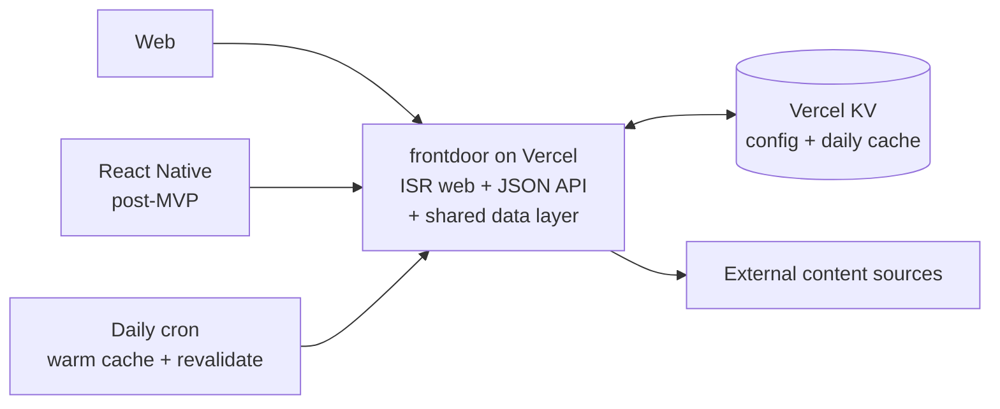
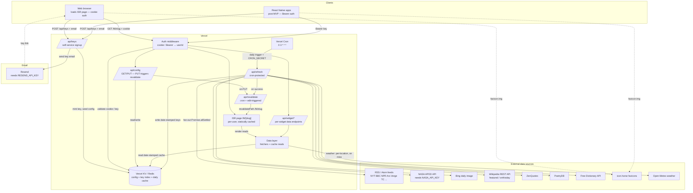
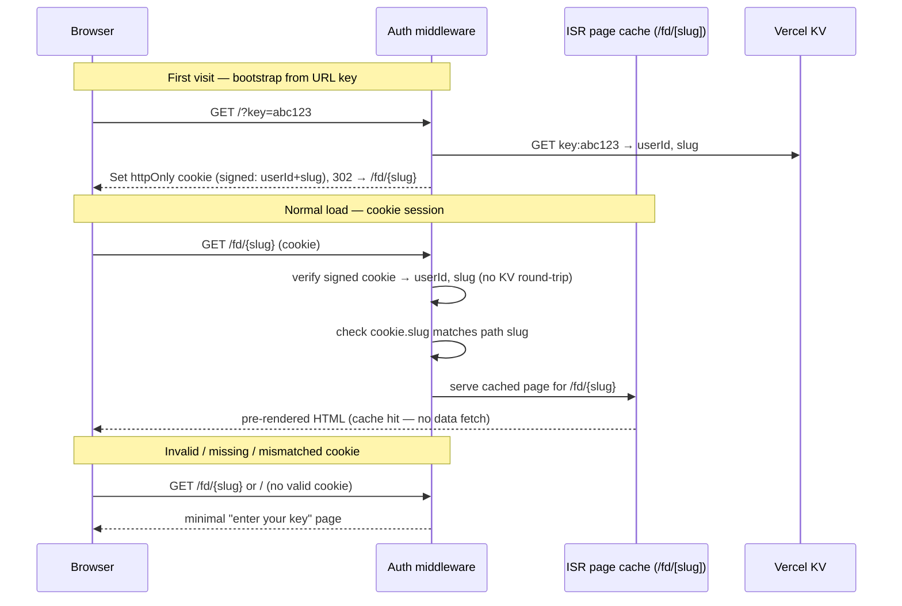
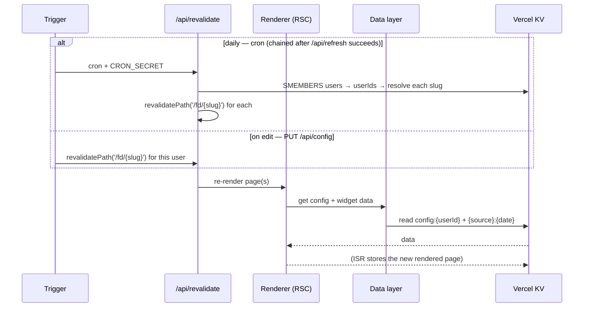

# frontdoor — Architecture

This document describes the runtime architecture of frontdoor: the services it
integrates with, how a page load flows through the system, and how data is cached.

For the *why* behind the design (the layout philosophy, the aesthetic, the widget
specs), see [`design/`](../design). For the original build-vs-rewrite mapping, see
[`design/06-architecture.md`](../design/06-architecture.md). This doc is the
consolidated, current view.

> **Relationship to the spec.** The design docs (`02-aesthetic-and-rendering.md`,
> `06-architecture.md`) describe a server-rendered "static document" with near-zero
> client JS. This architecture **keeps that for the web** — via per-user **ISR**
> (Incremental Static Regeneration) instead of a one-shot build — and **adds a JSON
> API** alongside it so the same data layer can back React Native iOS/Android apps
> post-MVP. The web stays a static-feeling document; the API is the extension the spec
> didn't anticipate. This is the hybrid: one data layer, two delivery paths.

---

## 1. Overview

frontdoor is a **Next.js app on Vercel** with two delivery paths over **one shared data
layer**:

- **Web** — server-rendered pages, statically cached **per user via ISR**. A page load
  is a cache hit: instant paint, near-zero client JS, no loading states on the hot path.
  Pages are revalidated daily by cron and on-demand when the user edits their config.
- **JSON API** — the same data layer exposed as HTTP endpoints with Bearer auth, for
  **React Native iOS/Android apps** (post-MVP).

Content is fetched from upstream sources server-side and cached daily; neither clients
nor the browser ever call third-party APIs directly.

There are four tiers of services:

1. **Platform** — the Vercel ecosystem (hosting, ISR, serverless API routes, KV, cron).
2. **External data sources** — keyless content APIs and RSS feeds, fetched server-side
   by the data layer.
3. **Auth & signup** — a hand-rolled per-user API-key scheme (no third-party identity
   provider); self-service signup via a `curl`-able endpoint, with the key delivered by
   email through **Resend**.
4. **Clients** — the ISR web app today; React Native iOS/Android apps post-MVP.

There is **no relational database** in v1 — Vercel KV (Redis) holds everything: user
accounts, the API-key index, dashboard config, and the daily content cache. The
account/config domain is expected to migrate to **Neon (Postgres) + Drizzle** post-v1,
once a real query need appears (see §8); KV then narrows to just the regenerable cache.

---

## 2. System diagram

### 2.1 Overview

The shape of the system in one glance — clients, the app, the cache, and a daily cron.
Widget-level data sources are collapsed into one box here; see §2.2 for the full view.



### 2.2 Detailed



---

## 3. Request flow

### 3.1 Signup — `POST /api/keys`

Self-service: a user `curl`s the endpoint with an email; the key is minted, the default
config is seeded, and the key is delivered by email via Resend. The HTTP response
**never contains the key** (so it can't be harvested by hammering the endpoint), and the
call is **idempotent** — re-signing-up with the same email re-sends the existing key.

```mermaid
sequenceDiagram
    participant U as User (curl)
    participant API as POST /api/keys
    participant KV as Vercel KV
    participant R as Resend

    U->>API: { "email": "you@example.com" }
    API->>API: validate email + rate-limit (IP + email)
    API->>KV: GET email:{email}
    alt already registered
        KV-->>API: userId → GET user:{userId}.apiKey
        API->>R: re-send existing key
    else new user
        API->>KV: SET key:{apiKey}, slug:{slug}, email:{email},<br/>user:{userId} (incl. apiKey+slug), config:{userId}; SADD users
        API->>R: send key email
    end
    API-->>U: 202 { "status": "check your email" }
    Note over U,R: email arrives → user opens /?key=... → cookie handoff → /fd/{slug} (§3.2)
```

### 3.2 Web page load — ISR cache hit

**Each user's dashboard is its own route, `/fd/[slug]`.** The `slug` is a short,
non-secret per-user id (minted at signup, stored on the user record) — *not* the API
key. This is what makes per-user ISR work: ISR caches by route path, so every user has
their own statically-cached page. The slug only **addresses** the page; the `httpOnly`
cookie still **gates access** — a leaked slug renders nothing without a valid cookie.

The common case is a **static cache hit**: the user's page was already rendered (by the
last cron revalidation or their last config edit) and is served straight from the ISR
cache — no data fetching, no render work on the hot path.



> **Hot-path cost.** Middleware runs on every request. To keep the cache hit genuinely
> instant, the cookie is **signed and carries `userId`+`slug`**, so the normal-load path
> verifies a signature instead of doing a KV round-trip. KV is only hit on the
> first-visit bootstrap and on auth failures.

### 3.3 Revalidation — how a page gets (re)built

A user's ISR page is re-rendered on two triggers. Rendering reads the **same data
layer** the API uses — global content from the cron-warmed KV cache, weather lazily.



### 3.4 React Native page load — API fan-out

RN apps have no ISR page; they fetch JSON. The app reads its stored key, calls
`/api/config`, then fans out to the per-widget endpoints, rendering natively as data
arrives.

```mermaid
sequenceDiagram
    participant C as RN app
    participant A as Auth middleware
    participant API as /api/config + /api/widget/*
    participant KV as Vercel KV

    C->>A: GET /api/config (Bearer key)
    A->>KV: GET key:{apiKey} → userId; GET config:{userId}
    KV-->>C: dashboard config JSON
    par per-widget fan-out
        C->>API: GET /api/widget/headlines?feeds=...&count=7 (Bearer)
        API->>KV: GET headlines:{hash}:{YYYY-MM-DD}
        KV-->>C: cached headlines
    and
        C->>API: GET /api/widget/weather?lat=..&lon=.. (Bearer)
        KV-->>C: cached weather (or lazy fetch on miss)
    and
        C->>API: GET /api/widget/text?source=quote (Bearer)
        KV-->>C: cached quote
    end
    C->>C: render natively as data arrives
```

---

## 4. Service integrations

### Platform (Vercel)

| Service | Role |
|---------|------|
| **Vercel** | Hosting — Next.js app (ISR pages + serverless API routes), CDN edge |
| **Vercel ISR** | Per-user statically-rendered pages; revalidated by cron + on config edit |
| **Vercel KV** (Redis) | Single source of truth — user config, API-key index, daily content cache |
| **Vercel Cron** | Daily at `0 3 * * *` — triggers `/api/refresh` then `/api/revalidate` |
| **Vercel Edge / CDN** | Caches public widget-endpoint responses via `s-maxage` (see §6) |

### External data sources

All are fetched **server-side only** and sent with `User-Agent: frontdoor/1.0`. All are
keyless **except NASA APOD**.

| Source | Used by | Auth | Cache strategy |
|--------|---------|------|----------------|
| RSS / Atom feeds (NYT, BBC, NPR, Ars, Verge, TC, Google AI, OpenAI, HF, econ/biz/science/research) | `headlines` | none | Cron-warmed (global) |
| NASA APOD (`api.nasa.gov`) | `image` | `NASA_API_KEY` | Cron-warmed (global) |
| Bing daily image | `image` | none | Cron-warmed (global) |
| Wikipedia REST API (featured feed + onthisday) | `image`, `text` | none | Cron-warmed (global) |
| ZenQuotes | `text` (quote) | none | Cron-warmed (global) |
| PoetryDB | `text` (poem) | none | Cron-warmed (global) |
| Free Dictionary API | `text` (word) | none | Cron-warmed (global) |
| icon.horse | `launcher` | none | Resolved at render time (URL only) |
| Open-Meteo | `weather` | none | Lazy, per-location (KV, on `/api/widget/weather` miss) |

> `stoic` and `word` selection are **offline/deterministic** (day-of-year index into a
> built-in list); only `word` then makes a network call for the definition.

### Email

| Service | Role |
|---------|------|
| **Resend** | Delivers the API-key email at signup. Official Next.js-friendly SDK; templates may be authored with `react-email`. Adds the `RESEND_API_KEY` secret. |

> Production sending requires a **verified domain** (SPF/DKIM DNS records) — e.g.
> `noreply@frontdoor.app`. This makes "frontdoor needs a real domain" a hard dependency,
> which the hosted app needs regardless.

### Auth & signup

No third-party identity provider. The same per-user API key authenticates both paths,
but the **transport differs by client** — because the web is server-rendered, it can use
the safer cookie mechanism, while RN needs a portable token:

- **Web — signed `httpOnly` cookie.** The key bootstraps from `?key=` on first visit;
  the auth middleware validates it against KV once, then sets a **signed** `httpOnly`
  cookie carrying `userId`+`slug` and redirects to the user's route `/fd/{slug}`. The
  cookie is the session — verified by signature on every load (no KV round-trip); the
  query param is bootstrap-only (it leaks via logs, history, `Referer`). Middleware also
  checks the cookie's `slug` matches the path, so one user can't load another's route.
- **React Native — `Authorization: Bearer {apiKey}`.** The app stores the key in the OS
  keychain / secure store and sends it on every API request. The auth middleware
  resolves `key:{apiKey}` → `userId`.
- **`RESEND_API_KEY`** — authenticates outbound mail to Resend.
- **`CRON_SECRET`** — bearer token Vercel attaches to cron requests; `/api/refresh` and
  `/api/revalidate` reject anything without it so they can't be triggered publicly.

`POST /api/keys` is a public, unauthenticated endpoint, so it is **rate-limited on both
IP and email** (it triggers outbound email — a spam vector). The authenticated widget
and config endpoints are **rate-limited per API key**. Upstash Ratelimit fits cleanly
since KV is already Upstash Redis.

**CORS** — the JSON API is called cross-origin by RN apps (and any future clients). Lock
the `Access-Control-Allow-Origin` allowlist; the web path is same-origin (server-rendered)
so it is not affected.

### Clients

| Client | Status | Delivery | Auth |
|--------|--------|----------|------|
| **Web** | v1 | Per-user ISR route `/fd/[slug]`, server-rendered, statically cached | signed `httpOnly` cookie |
| **React Native (iOS/Android)** | post-MVP | JSON API fan-out, rendered natively | `Bearer` key in secure storage |

---

## 5. API surface

All endpoints under `/api`. Responses are JSON. The `/api/widget/*` endpoints exist for
**React Native** (and future API clients) — the **web render never calls them**, it
reads the data layer in-process. `/api/config` is the exception: it is used by *both*
RN **and** the web config editor (the web *render* doesn't need it, the *editor* does).

| Endpoint | Auth | Purpose |
|----------|------|---------|
| `POST /api/keys` | public | Signup — `{ email }` → mints key, slug, seeds config, emails key (§3.1) |
| `GET /api/config` | Bearer / cookie | The caller's dashboard config JSON (RN + web editor) |
| `PUT /api/config` | Bearer / cookie | Replace the caller's config (Zod-validated); **triggers `/api/revalidate` for `/fd/{slug}`** |
| `GET /api/widget/headlines` | Bearer | `?feeds=...&count=N` → interleaved headlines |
| `GET /api/widget/weather` | Bearer | `?lat=..&lon=..` → current + 3-day forecast |
| `GET /api/widget/image` | Bearer | `?source=nasa-apod\|bing-daily\|wikimedia-potd` |
| `GET /api/widget/text` | Bearer | `?source=quote\|stoic\|poem\|onthisday\|wikipedia\|word` |
| `POST /api/refresh` | `CRON_SECRET` | Cron-only — re-warms the global content cache in KV; on success chains to `/api/revalidate` |
| `POST /api/revalidate` | `CRON_SECRET` / internal | `revalidatePath('/fd/{slug}')` — all users (cron, via the `users` set) or one user (after a config edit) |

**Design rule: widget endpoints are keyed by content params, never by user.** A
`headlines` request with the same `feeds`+`count` returns the identical payload for
every user, so the response is cacheable and shared (see §6). `links` and `launcher`
widgets need *no* endpoint — they are pure config. Both delivery paths sit on the same
data layer: the web ISR render calls it as functions; the JSON API exposes it over HTTP.

---

## 6. Caching strategy

**Two distinct kinds of cache — keep them separate in your head:**

1. **Per-user *rendered page* (ISR).** Yes, this is per-user — but it caches *assembled
   HTML*, not upstream content. It is cheap to store, and revalidated narrowly (one
   user's page on their edit; all pages once daily on cron). This is what makes the web
   load instant.
2. **Per-user *content data*? No — never.** The data the page is built from doesn't vary
   by user. It is either **global** (RSS, NASA, Bing, Wikimedia, quote, poem, onthisday,
   word — identical for everyone) or **per-location** (weather — varies by lat/lon, not
   by user). Caching content per user would multiply storage and tank hit rates for
   zero benefit. The only genuinely per-user *datum* is the **config**, which lives in
   KV as a source of truth, not a cache.

So: the ISR layer is per-user; everything beneath it is shared. Layers, top to bottom:

| Layer | Scope | Keyed by | Refreshed by |
|-------|-------|----------|--------------|
| **ISR rendered page** | per-user | route `/fd/[slug]` | cron daily + config-edit (§3.3) |
| **Edge / CDN** (API responses) | shared | request URL = content params | `s-maxage` TTL |
| **KV daily content cache** | shared (global / per-location) | `{source}:{date}` | cron `/api/refresh` + lazy miss |

> **Edge-caching `/api/widget/*` is not automatic** — those endpoints are `Bearer`-
> authed, and CDNs do not cache responses to requests carrying `Authorization` by
> default. The payloads genuinely aren't user-specific, so the fix is deliberate:
> set explicit `Cache-Control: s-maxage` and exclude the `Authorization` header from the
> edge cache key. Until that's wired up, treat the edge layer as a planned optimization,
> not a given (see §8, open).

The KV content layer has two strategies, split by *what varies*:

```mermaid
graph LR
    subgraph Eager — cron-warmed, GLOBAL
        direction TB
        E1[Vercel Cron 0 3 * * *] --> E2[/api/refresh]
        E2 --> E3[Promise.allSettled fan-out]
        E3 --> E4[Write source:YYYY-MM-DD to KV]
    end

    subgraph Lazy — on-demand, PER-LOCATION
        direction TB
        L1[/api/widget/weather] --> L2{KV hit?}
        L2 -->|hit| L4[return cached]
        L2 -->|miss| L3[fetch Open-Meteo → write KV]
    end
```

- **Eager (global).** Everything except weather is the *same for every user* — RSS,
  NASA, Bing, Wikimedia, quote, poem, onthisday, featured article, word. Cron warms it
  **once** into date-stamped KV keys, shared across all users. Keeps hit rates high
  regardless of user count and avoids hammering upstream sources N times.
- **Lazy (per-location).** Weather varies by location (not by user). Can't pre-warm
  every location, so `/api/widget/weather` fetches on demand on a KV miss and writes a
  `weather:{lat,lon}:{date}` key — shared by every user at that location.
- **Resilience.** On a KV miss (cron failed / cold key) or an API error, the data layer
  falls back to a live fetch, then to stale data, then to a structured "could not load"
  payload — it never throws. Each source degrades independently, so one dead feed
  degrades one widget, not the page.
- **Source-specific quirks** are absorbed by the data layer, not the cache: e.g. NASA
  APOD is a *video* on some days (`media_type != "image"`) — the fetcher treats that as
  "no image today" and falls back to the last cached image (see `design/04-data-sources.md`).

### KV key spaces

| Key | Value |
|-----|-------|
| `key:{apiKey}` | `userId` |
| `email:{email}` | `userId` — signup idempotency |
| `slug:{slug}` | `userId` — resolves a `/fd/[slug]` route to its user |
| `user:{userId}` | `{ email, apiKey, slug, name?, createdAt }` — account record; `apiKey` here powers the idempotent key re-send (§3.1); `name?` / future profile fields land here |
| `users` | SET of all `userId`s — lets cron enumerate users to revalidate (§3.3) |
| `config:{userId}` | dashboard config JSON (see [`design/05-config-schema.md`](../design/05-config-schema.md)) |
| `{source}:{YYYY-MM-DD}` | cached payload for a *simple* global source — `nasa-apod`, `bing-daily`, `wikimedia-potd`, `quote`, `poem`, `onthisday`, `wikipedia`, `word` |
| `headlines:{feedSetHash}:{YYYY-MM-DD}` | cached headlines, keyed by a hash of the feed set + count (headlines vary by which feeds) |
| `weather:{lat,lon}:{YYYY-MM-DD}` | cached weather payload, shared by location |

> `stoic` has no key — it is fully offline/deterministic (day-of-year index), computed
> at render time.

---

## 7. Rendering model

The web largely **keeps the spec's model** (`02-aesthetic-and-rendering.md`): server-
rendered, near-zero client JS, no client-side content fetching. The only change from the
spec is *when* it renders — per-user **ISR** instead of a one-shot build.

**Web (ISR):**

- **All 7 widgets are React Server Components.** They render to HTML on the server,
  reading the data layer in-process — no client-side fetch, no loading states on the
  hot path. The rendered page is stored in the ISR cache per user.
- **The only client components are `<Clock/>` and `<SearchBar/>`** — the entire client
  bundle is single-digit KB. Hydration is near-instant and invisible.
- **`links` and `launcher`** render straight from the user's config; `headlines`,
  `weather`, `image`, `text` read their data from the data layer at render time.
- The **search shortcut map** is built at render time by walking the `links`/`launcher`
  widgets for `key` fields, deduped (warn on collision), passed to `<SearchBar/>` as a
  prop.
- A page is (re)rendered only on revalidation (§3.3), never on a normal page load.
- `theme.css` ships as a global stylesheet. No CSS framework, no component library.

**React Native (post-MVP):**

- Reuses the **data model, config schema, and API contract** — not the DOM components.
- Fetches `/api/config` then the per-widget endpoints (§3.4) and renders natively.
- The widget *layout logic* (the 6-section arc, spans, ordering) is the shared surface;
  the rendering is platform-native.

---

## 8. Open decisions

**Settled:**

- **API-key provisioning.** Self-service via `POST /api/keys` with an email; key minted,
  default config seeded, delivered by email through Resend (see §3.1). Replaces the
  spec's vague "provisioned manually."
- **Delivery model.** Hybrid: web is **per-user ISR** (server-rendered, statically
  cached, keeps the spec's static-document feel); a **JSON API** on the same data layer
  serves React Native post-MVP. Web auth = `httpOnly` cookie, RN auth = `Bearer` key.
- **Data store for v1.** KV-only — accounts, API-key index, config, and the content
  cache all live in Vercel KV. Accepted trade-offs: the system-of-record shares a store
  with the regenerable cache, and every lookup is a hand-rolled index key. **Planned
  migration:** move the account + config domain to **Neon (Postgres) + Drizzle** once a
  concrete query need appears (admin/support views, user search, analytics); KV then
  keeps only the regenerable content cache. Deferred deliberately, not indefinitely.
- **Per-user ISR addressing.** Each dashboard is its own route `/fd/[slug]`, where `slug`
  is a short non-secret per-user id (minted at signup, stored on the user record). ISR
  caches by path, so this is what makes per-user static caching work; the signed cookie
  still gates access. `/api/revalidate` targets a user via `revalidatePath('/fd/{slug}')`.
- **KV provider.** Vercel KV via the Vercel Marketplace (Upstash Redis) — accessed
  through the Vercel integration. Upstash Ratelimit is used for rate limiting.

**Still open:**

1. **ISR revalidation fan-out at scale.** Enumeration is solved (the `users` set), but
   cron revalidating *every* user's page in one window is still O(users) of render work
   — fine for small N, a pipeline concern at large N. Consider staggering, on-read
   revalidation, or revalidate-only-active-users.
2. **Edge-caching the `Bearer`-authed `/api/widget/*` endpoints.** Their payloads aren't
   user-specific, but the `Authorization` header defeats default CDN caching. Needs a
   deliberate `Cache-Control: s-maxage` + cache-key policy (exclude `Authorization`), or
   the edge layer in §6 stays a no-op. Contained fix, but unbuilt.
3. **Geolocation.** Never IP-geolocate from a serverless function — it returns Vercel's
   datacenter. Choose: (a) store `lat`/`lon` in user config, (b) one-time browser
   geolocation prompt persisted to config, or (c) device geolocation on RN.
4. **Cron function timeout.** ~15+ feeds fetched in one invocation can exceed the
   function duration limit even with `Promise.allSettled`. Confirm the Vercel plan
   limit; consider batching or per-source sub-requests if needed.
5. **Config editing.** v1 may ship with no editing UI (config `PUT` via API directly).
   A settings UI to add/reorder widgets is the main scope fork — see
   [`design/06-architecture.md`](../design/06-architecture.md).
