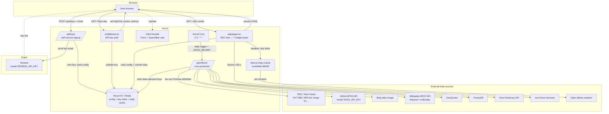
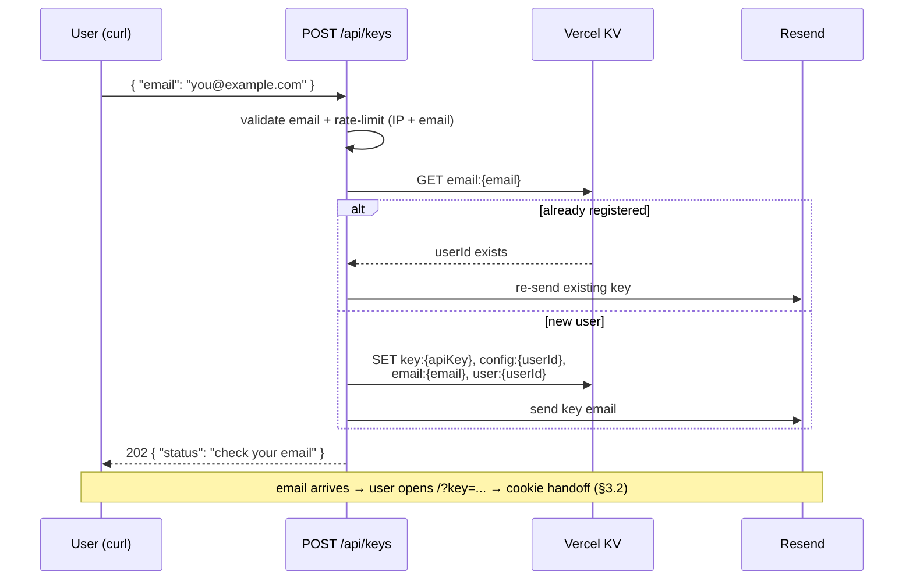
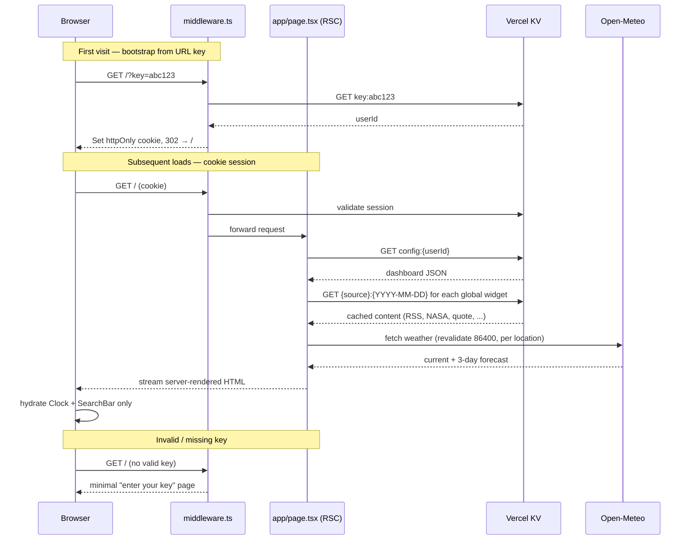

# frontdoor — Architecture

This document describes the runtime architecture of frontdoor: the services it
integrates with, how a page load flows through the system, and how data is cached.

For the *why* behind the design (the layout philosophy, the aesthetic, the widget
specs), see [`design/`](../design). For the original build-vs-rewrite mapping, see
[`design/06-architecture.md`](../design/06-architecture.md). This doc is the
consolidated, current view.

---

## 1. Overview

frontdoor is a **Next.js app on Vercel**. The defining constraint is that a page load
is a *static document*: all content is server-rendered HTML + CSS, fetched server-side
and cached daily, with near-zero client JavaScript.

There are three tiers of services:

1. **Platform** — the Vercel ecosystem (hosting, edge middleware, KV store, cron).
2. **External data sources** — keyless content APIs and RSS feeds, fetched server-side.
3. **Auth & signup** — a hand-rolled per-user API-key scheme (no third-party identity
   provider); self-service signup via a `curl`-able endpoint, with the key delivered by
   email through **Resend**.

There is **no relational database** in v1. Vercel KV (Redis) holds everything: user
config, the API-key index, and the daily content cache.

---

## 2. System diagram



---

## 3. Request flow

### 3.1 Signup — `POST /api/keys`

Self-service: a user `curl`s the endpoint with an email; the key is minted, the default
config is seeded, and the key is delivered by email via Resend. The HTTP response
**never contains the key** (so it can't be harvested by hammering the endpoint), and the
call is **idempotent** — re-signing-up with the same email re-sends the existing key.



### 3.2 Page load



---

## 4. Service integrations

### Platform (Vercel)

| Service | Role |
|---------|------|
| **Vercel** | Hosting, serverless functions, edge middleware |
| **Vercel KV** (Redis) | Single source of truth — user config, API-key index, daily content cache |
| **Vercel Cron** | Triggers `/api/refresh` daily at `0 3 * * *` |
| **Next.js Data Cache** | `fetch(..., { next: { revalidate: 86400 } })` for the lazy weather path |

### External data sources

All are fetched **server-side only** and sent with `User-Agent: frontdoor/1.0`. All are
keyless **except NASA APOD**.

| Source | Used by | Auth | Cache strategy |
|--------|---------|------|----------------|
| RSS / Atom feeds (NYT, BBC, NPR, Ars, Verge, TC, Google AI, OpenAI, HF, econ/biz/science/research) | `headlines` | none | Cron-warmed (global) |
| NASA APOD (`api.nasa.gov`) | `image` | `NASA_API_KEY` | Cron-warmed (global) |
| Bing daily image | `image` | none | Cron-warmed (global) |
| Wikipedia REST API (featured feed + onthisday) | `image`, `text` | none | Cron-warmed (global) |
| ZenQuotes | `text` (quote) | none | Cron-warmed (global) |
| PoetryDB | `text` (poem) | none | Cron-warmed (global) |
| Free Dictionary API | `text` (word) | none | Cron-warmed (global) |
| icon.horse | `launcher` | none | Resolved at render time (URL only) |
| Open-Meteo | `weather` | none | Lazy, per-location (Next.js Data Cache) |

> `stoic` and `word` selection are **offline/deterministic** (day-of-year index into a
> built-in list); only `word` then makes a network call for the definition.

### Email

| Service | Role |
|---------|------|
| **Resend** | Delivers the API-key email at signup. Official Next.js-friendly SDK; templates may be authored with `react-email`. Adds the `RESEND_API_KEY` secret. |

> Production sending requires a **verified domain** (SPF/DKIM DNS records) — e.g.
> `noreply@frontdoor.app`. This makes "frontdoor needs a real domain" a hard dependency,
> which the hosted app needs regardless.

### Auth & signup

No third-party identity provider. Secrets involved:

- **Per-user API key** — bootstraps a session. Minted by `POST /api/keys` at signup
  (see §3.1), delivered by email. On use: `?key=` in the URL → validated against KV →
  `httpOnly` cookie set → redirect to a clean URL. The cookie is the real session; the
  query param is bootstrap-only (it leaks via logs, history, `Referer`).
- **`RESEND_API_KEY`** — authenticates outbound mail to Resend.
- **`CRON_SECRET`** — bearer token Vercel attaches to cron requests; `/api/refresh`
  rejects anything without it so it can't be triggered publicly.

`POST /api/keys` is a public, unauthenticated endpoint, so it is **rate-limited on both
IP and email** (it triggers outbound email — a spam vector). Upstash Ratelimit fits
cleanly since KV is already Upstash Redis.

---

## 5. Caching strategy

Two strategies, split by *what varies*:

```mermaid
graph LR
    subgraph Eager — cron-warmed, GLOBAL
        direction TB
        E1[Vercel Cron 0 3 * * *] --> E2[/api/refresh]
        E2 --> E3[Promise.allSettled fan-out]
        E3 --> E4[Write source:YYYY-MM-DD to KV]
    end

    subgraph Lazy — on-demand, PER-LOCATION
        direction TB
        L1[Widget render] --> L2[fetch revalidate 86400]
        L2 --> L3[Open-Meteo]
    end
```

- **Eager (global).** Everything except weather is the *same for every user* — RSS,
  NASA, Bing, Wikimedia, quote, poem, onthisday, featured article, word. Cron warms it
  **once** into date-stamped KV keys, shared across all users. Keeps hit rates high
  regardless of user count and avoids hammering upstream sources N times.
- **Lazy (per-location).** Weather varies by location (not by user). Can't pre-warm
  every location, so fetch on demand with a 24h revalidate, keyed by lat/lon.
- **Resilience.** On a KV miss (cron failed / cold key) or an API error, fall back to a
  live fetch, then to stale data — never render an error that breaks the page. Each
  widget degrades independently: a dead feed shows a quiet "could not load" line.

### KV key spaces

| Key | Value |
|-----|-------|
| `key:{apiKey}` | `userId` |
| `email:{email}` | `userId` — signup idempotency + key recovery |
| `user:{userId}` | `{ email, createdAt }` — account record / audit |
| `config:{userId}` | dashboard config JSON (see [`design/05-config-schema.md`](../design/05-config-schema.md)) |
| `{source}:{YYYY-MM-DD}` | cached payload for a global source (e.g. `nasa-apod:2026-05-14`) |

---

## 6. Rendering model

- **All 7 widgets are React Server Components** — they render to HTML on the server and
  ship zero client JS.
- **The only client components are `<Clock/>` and `<SearchBar/>`** — the entire client
  bundle is single-digit KB. Hydration is near-instant and invisible.
- The **search shortcut map** is built at render time by walking every `links` and
  `launcher` widget for `key` fields, deduped (warn on collision), and passed to
  `<SearchBar/>` as a prop.
- `theme.css` ships as a global stylesheet. No CSS framework, no component library.

---

## 7. Open decisions

**Settled:**

- **API-key provisioning.** Self-service via `POST /api/keys` with an email; key minted,
  default config seeded, delivered by email through Resend (see §3.1). Replaces the
  spec's vague "provisioned manually."

**Still open:**

1. **Geolocation.** Never IP-geolocate from a serverless function — it returns Vercel's
   datacenter. Choose: (a) store `lat`/`lon` in user config, (b) use Vercel edge
   `request.geo`, or (c) a one-time browser geolocation prompt persisted to config.
2. **Cron function timeout.** ~15+ feeds fetched in one invocation can exceed the
   function duration limit even with `Promise.allSettled`. Confirm the Vercel plan
   limit; consider batching or per-source sub-requests if needed.
3. **KV provider.** Vercel KV is now provisioned via the Vercel Marketplace (Upstash
   Redis). Confirm whether to use it through Vercel or integrate Upstash directly.
4. **Config editing.** v1 may ship with no editing UI (config is POSTed or seeded). A
   settings UI to add/reorder widgets is the main scope fork — see
   [`design/06-architecture.md`](../design/06-architecture.md).
