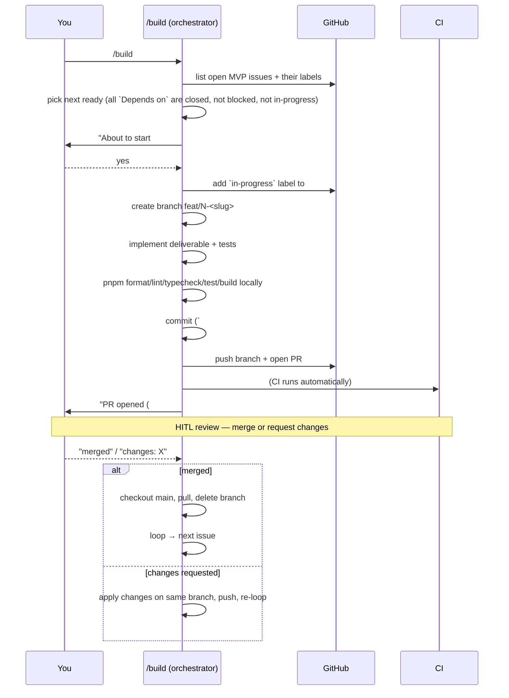

# build skill — design

A Claude Code skill (`/build`) that drives the frontdoor MVP issues to completion, one
at a time, with HITL between each. v0.1 — sequential, in-chat, PR-per-issue.

This doc is the spec. The skill itself lives at
[`.claude/skills/build.md`](../.claude/skills/build.md). The 27 issues it walks are on
the `MVP` milestone; the dependency graph and per-item deliverables live in
[`docs/implementation-plan.md`](./implementation-plan.md).

---

## Why

We have 27 well-structured GitHub issues with machine-readable dependencies (`Depends
on: #N, #M` in each body), labels by phase/track, a milestone, and a working
codebase + test harness from #1 + #29. The orchestrator turns that structure into a
loop: *pick the next ready issue → implement it the same way every time → review →
merge → next*. Consistency is the value; speed is a side effect.

## The cycle



## State

GitHub is the single source of truth. The skill has no hidden state — every invocation
re-reads GH and recomputes what's ready. This is what makes it resumable: kill
mid-cycle, restart, it picks up exactly where it left off.

| Signal | Meaning |
|--------|---------|
| issue **open**, no `in-progress` | available to work (subject to deps) |
| issue **open**, `in-progress` | currently being worked (skip; resume the in-flight branch) |
| issue **closed** | done |
| `blocked` label | hold; needs human attention before retry |
| PR open with `Fixes #N` | in HITL review |

A "ready" issue is: **open, not `in-progress`, not `blocked`, and every `Depends on`
issue is closed.**

Optional local side-channel: `.claude/build-log/run-<timestamp>.json` — a per-run
record of which issues were attempted, PR numbers, durations, test results. Useful
for retros; not load-bearing.

## Per-issue agent prompt — what context to load

When working an issue, the agent (which in v0.1 is just in-chat Claude) loads:

1. **The issue body** — verbatim, including the `Deliverable`, `Depends on`, and any
   `Visual reference` line.
2. **Always-load docs:**
   - `docs/mvp.md` (what's in scope)
   - `docs/architecture.md` (system shape, key spaces, auth model, ISR routing)
   - `docs/implementation-plan.md` → the **Testing** section (test expectations per
     issue type)
3. **Conditionally load** based on which area the issue touches:
   - Widget items (#11–#15): `design/03-widget-specs.md`, `design/reference/index.html`
     (the visual fidelity reference), `design/theme.css`
   - Data layer items (#5–#9): `design/04-data-sources.md` (endpoints + quirks)
   - Auth / signup (#19, #20): `docs/architecture.md` §3 + §4 (signup flow, auth)
   - Config (#3, #22): `design/05-config-schema.md`
   - Page/ISR (#23, #25): `docs/architecture.md` §3 (the ISR flows)
4. **Repo state** — the agent reads the codebase directly via its tools.

## Conventions the agent must follow

Hard-won from #1 + #29; these are non-negotiable, encoded in the skill:

- **Branch:** `feat/N-<kebab-slug>` (slug derived from issue title, lowercased)
- **Commit:** subject line `#N <issue title>`, body explains *what* and *why*, ends
  with `Fixes #N` plus `Co-Authored-By` footer
- **PR:** title `#N <issue title>`, body restates deliverable + notes for reviewers +
  local verification commands, ends with `Fixes #N`
- **Always pass locally before pushing:** `pnpm format` → `format:check` →
  `typecheck` → `lint` → `test` → `build`. If a data-layer issue, also relevant tests
  in `pnpm test`. If touching anything user-facing, also `pnpm test:e2e` where
  applicable.
- **Do not reformat `design/`** — it's IP reference material (already in
  `.prettierignore`; don't remove that).
- **pnpm 11 native-build trap** — when adding a dep with postinstall scripts, also add
  it to `pnpm-workspace.yaml` `allowBuilds: { name: true }`. Otherwise every later
  `pnpm <script>` call aborts.
- **Test conventions** — co-located `foo.test.ts` next to `foo.ts`; E2E in `e2e/`;
  every upstream HTTP call mocked via MSW; `onUnhandledRequest: 'error'` is enforced.
- **Folder structure** — populate the stubs from #1: `src/components/widgets/`,
  `src/lib/{data,auth,kv}/`, `src/styles/`.
- **Secrets** — never commit `.env.local`; `.env.example` is the surface.

## HITL touchpoints (v0.1)

Two pause points per issue:

1. **Before starting** — "About to start #N. Proceed?" — lets you intervene if deps
   look wrong, the issue body needs updating, or you want to skip.
2. **After PR opens** — "PR #M opened. Awaiting your review/merge." — the main HITL.
   You either merge (success path) or comment with required changes.

After a merge, the skill resumes automatically — no third pause. After a phase boundary
completes (last issue of a phase merged), the skill posts a short summary before
starting the next phase. This is the only "phase-level" gate; the rest is per-issue.

## Failure policy

- **Local checks fail** (lint/typecheck/test/build): stop, surface the error, ask for
  guidance. Don't push broken code to open a PR that will fail CI.
- **CI fails on the PR:** alert you, pull the CI log, propose a fix; on your approval,
  push the fix to the same branch.
- **Two consecutive cycles on the same issue fail:** add the `blocked` label, post a
  comment with the failure summary, halt the run. Resuming requires either fixing the
  issue's spec or removing `blocked` manually.

Halt over skip. In sequential mode, a failure is a signal that something is off (spec,
convention, environment) — moving on to the next issue tends to spread the rot.

## What's NOT in v0.1

- **Parallel worktree agents** — graduate to v0.2 once the sequential loop is proven
  and reused over several issues
- **CI auto-merge** — v0.3
- **Per-agent retries** beyond the manual "fix and push" above
- **Issue body auto-update** — the skill reads issues but doesn't edit them (except
  labels); spec changes are still your call

## How to invoke

```
/build           # walk the next ready issue end-to-end
/build status    # show progress: closed / in-flight / blocked / ready
/build #N        # work issue N explicitly (skip the ready check)
/build resume    # if interrupted mid-cycle, pick up the in-flight branch
```

(`status`, `#N`, `resume` are nice-to-haves for v0.1; the bare `/build` is the core.)

## Versions

| Version | Adds | Status |
|---------|------|--------|
| **v0.1** | Sequential, in-chat, PR-per-issue, HITL between each | this issue (#33) |
| v0.2 | Parallel via `Agent` + `isolation: "worktree"`; HITL at phase boundaries only | follow-up issue |
| v0.3 | CI auto-merge on green; browsable build log; retry policy | follow-up issue |
