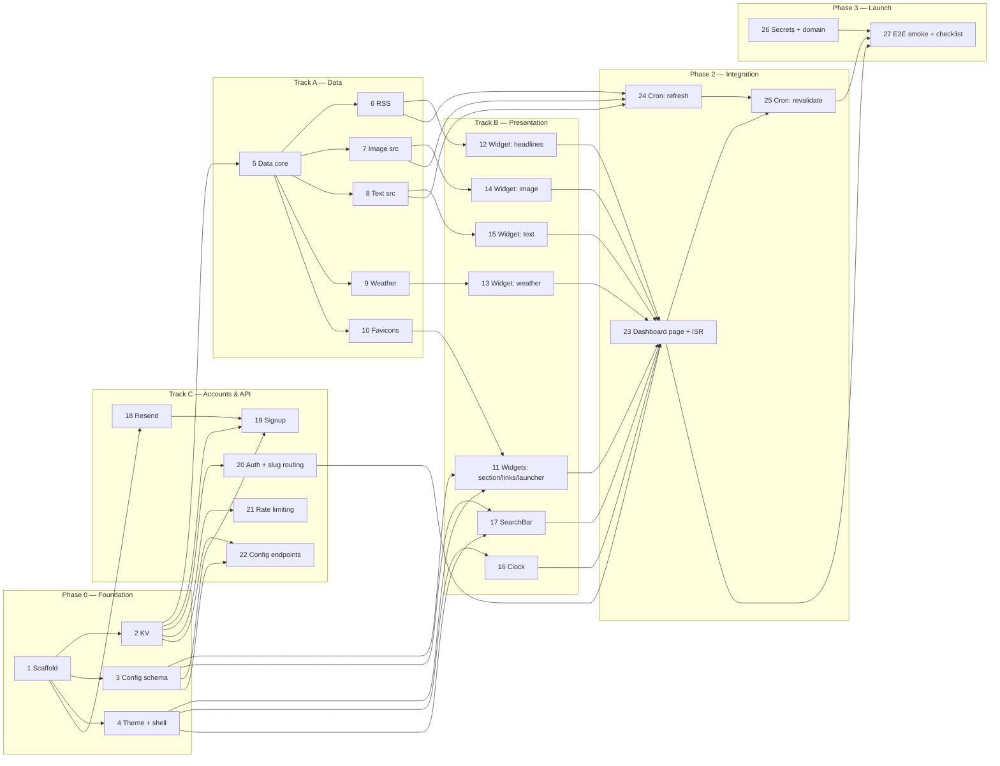

# frontdoor — MVP implementation plan

The MVP scope from [`docs/mvp.md`](./mvp.md), broken into **27 work items** sized to
become GitHub issues. Each item lists its **deliverable**, what it **depends on**, and
what it can run **in parallel** with.

Structure: a **Foundation** phase that blocks everything, then **three tracks** that run
largely in parallel (Data, Presentation, Accounts & API), then **Integration** and
**Launch**.

---

## Dependency overview

**Critical path:** 1 → 2 → 5 → 6 → 12 → 23 → 25 → 27.

---

## Phase 0 — Foundation

> Item 1 blocks everything. Items 2–4 can start as soon as 1 lands and run in parallel.

### 1. Project scaffold & Vercel deploy
- **Deliverable:** Next.js (App Router) + TypeScript project, lint/format config, agreed
  folder structure, a hello-world deployed to Vercel, env-var plumbing.
- **Depends on:** —
- **Parallel with:** —

### 2. Vercel KV setup + typed client wrapper
- **Deliverable:** KV provisioned (Upstash via Vercel Marketplace); a typed client with
  helpers for every key space in `architecture.md` §6 (`key:`, `slug:`, `user:`,
  `users` set, `config:`, `{source}:{date}`, `headlines:`, `weather:`).
- **Depends on:** 1
- **Parallel with:** 3, 4

### 3. Config schema (Zod) + default config
- **Deliverable:** the dashboard JSON schema as Zod (6 sections, 7 widget types,
  per-type fields per `design/05`); a one-time migration of the original YAML dashboard
  → the seeded default config JSON (with NYC fallback coords on the weather widget).
- **Depends on:** 1
- **Parallel with:** 2, 4

### 4. Theme port + layout shell
- **Deliverable:** `theme.css` ported, `next/font` self-hosting IBM Plex (no
  render-blocking `@import`), the base page chrome (background gradients, dot-grid
  texture, container, CSS variables).
- **Depends on:** 1
- **Parallel with:** 2, 3

---

## Track A — Data layer & content sources

> Runs after item 2. Item 5 is the track's foundation; 6–10 are parallel after it.

### 5. Data layer core
- **Deliverable:** the shared fetch wrapper (`User-Agent`, timeouts), date-stamped KV
  cache read/write, and the resilience ladder (KV miss → live fetch → stale → structured
  "could not load"). The in-process API the ISR render and (later) the JSON API call.
- **Depends on:** 2
- **Parallel with:** —

### 6. RSS / Atom fetcher
- **Deliverable:** RSS 2.0 + Atom parsing, multi-feed round-robin interleaving,
  feed-set-hash cache key. Powers `headlines`.
- **Depends on:** 5
- **Parallel with:** 7, 8, 9, 10

### 7. Image source fetchers
- **Deliverable:** NASA APOD (incl. `media_type != image` video-fallback), Bing daily,
  Wikimedia POTD — field-mapped per `design/04`.
- **Depends on:** 5
- **Parallel with:** 6, 8, 9, 10

### 8. Text source fetchers
- **Deliverable:** ZenQuotes, PoetryDB, Wikipedia featured + onthisday, Free Dictionary;
  plus the offline `stoic` list and deterministic `word` selection (day-of-year).
- **Depends on:** 5
- **Parallel with:** 6, 7, 9, 10

### 9. Weather fetcher
- **Deliverable:** Open-Meteo current + 3-day forecast, WMO weather-code mapping,
  per-location (`lat,lon`) cache key, lazy on-miss fetch.
- **Depends on:** 5
- **Parallel with:** 6, 7, 8, 10

### 10. Favicon resolution
- **Deliverable:** `icon.horse` URL resolution + the letter-tile fallback contract for
  the `launcher` widget. (Small — may be merged into item 11.)
- **Depends on:** 5
- **Parallel with:** 6, 7, 8, 9

---

## Track B — Presentation (widgets + interactive)

> Runs after items 3 + 4. Config-only widgets (11) need nothing from Track A;
> data-backed widgets (12–15) each need their fetcher.

### 11. Widgets: `section`, `links`, `launcher`
- **Deliverable:** the three config-only widgets — section divider; links list with tag
  pills + shortcut-key badges; launcher favicon grid (uses item 10).
- **Depends on:** 3, 4, 10
- **Parallel with:** 12–17

### 12. Widget: `headlines`
- **Deliverable:** the RSS aggregator widget — interleaved rows, source labels, `via …`
  footer.
- **Depends on:** 3, 4, 6
- **Parallel with:** 11, 13–17

### 13. Widget: `weather`
- **Deliverable:** current temp + WMO icon, detail rows, 3-day strip, sunrise/sunset.
- **Depends on:** 3, 4, 9
- **Parallel with:** 11, 12, 14–17

### 14. Widget: `image`
- **Deliverable:** the picture-of-the-day widget — `nasa-apod` / `bing-daily` /
  `wikimedia-potd` / `static`; caption, description, source label, click-through.
- **Depends on:** 3, 4, 7
- **Parallel with:** 11–13, 15–17

### 15. Widget: `text`
- **Deliverable:** the daily-text widget — all 6 sources; `white-space: pre-wrap` body,
  attribution line, source label.
- **Depends on:** 3, 4, 8
- **Parallel with:** 11–14, 16, 17

### 16. `Clock` client component
- **Deliverable:** the ticking clock — one of only two client components.
- **Depends on:** 4
- **Parallel with:** 11–15, 17

### 17. `SearchBar` client component + shortcut map
- **Deliverable:** keydown handling + shortcut routing; the shortcut map built at render
  time by walking `links`/`launcher` `key` fields (dedupe + collision warning), passed
  in as a prop.
- **Depends on:** 3, 4
- **Parallel with:** 11–16

---

## Track C — Accounts & API

> Runs after items 2 + 3. Items 18–22 are largely parallel (19 needs 18).

### 18. Resend integration
- **Deliverable:** email sending wired up, the "your key" email template (`react-email`),
  and the verified-sending-domain setup documented.
- **Depends on:** 1
- **Parallel with:** 20, 21, 22

### 19. Signup endpoint `POST /api/keys`
- **Deliverable:** mint API key + `userId` + `slug`; seed default config; idempotent
  re-send on known email; write all KV key spaces + `SADD users`; return `202`.
- **Depends on:** 2, 3, 18
- **Parallel with:** 20, 21, 22

### 20. Auth middleware + slug routing
- **Deliverable:** `?key=` bootstrap → validate → signed `httpOnly` cookie → `302
  /d/{slug}`; signature-verify on every load (no KV round-trip); cookie/path slug-match
  check; the "enter your key" fallback page.
- **Depends on:** 2
- **Parallel with:** 18, 19, 21, 22

### 21. Rate limiting
- **Deliverable:** Upstash Ratelimit on `POST /api/keys` (IP + email) and on the authed
  config endpoints (per key). (May be merged into 19/22.)
- **Depends on:** 2
- **Parallel with:** 18, 19, 20, 22

### 22. Config endpoints `GET` / `PUT /api/config`
- **Deliverable:** read/replace the caller's config; `PUT` is Zod-validated and triggers
  `/api/revalidate` for the user's `/d/{slug}` page.
- **Depends on:** 2, 3, 20
- **Parallel with:** 18, 19, 21

---

## Phase 2 — Integration

### 23. Dashboard page `/d/[slug]` + ISR
- **Deliverable:** the per-user route — assemble the fixed 6-section arc, the 4-column
  responsive grid (collapse at 1100px / 600px, `span` 1–4), wire every widget, configure
  ISR.
- **Depends on:** 11–17, 20
- **Parallel with:** 24

### 24. Cron: `/api/refresh`
- **Deliverable:** re-warm every global source — `Promise.allSettled` fan-out, write
  date-stamped KV keys, `CRON_SECRET`-protected. (Weather is lazy, not warmed here.)
- **Depends on:** 6, 7, 8
- **Parallel with:** 23

### 25. Cron: `/api/revalidate` + `vercel.json`
- **Deliverable:** enumerate the `users` set → `revalidatePath('/d/{slug}')` each;
  chained after `/api/refresh`; the daily `0 3 * * *` cron schedule in `vercel.json`.
- **Depends on:** 23, 24
- **Parallel with:** —

---

## Phase 3 — Launch

### 26. Secrets & domain
- **Deliverable:** production env vars (`NASA_API_KEY`, `RESEND_API_KEY`, `CRON_SECRET`,
  cookie-signing secret); a real domain; Resend domain verification (SPF/DKIM DNS).
- **Depends on:** 1 (can be done early; required before 27)
- **Parallel with:** everything

### 27. End-to-end test suite (Playwright) + visual launch pass
- **Deliverable:** a Playwright E2E suite covering the full happy path (signup → email
  → `?key=` → cookie → `/d/{slug}` dashboard) plus the "enter your key" fallback and
  slug-mismatch reject; resilience checks scripted (dead feed, KV miss); plus a manual
  `design/02` anti-goals visual pass (no spinners, no layout shift, near-zero client
  JS — the eyeball-only bits).
- **Depends on:** 23, 25, 26, 29
- **Parallel with:** —

---

## Testing

- **Stack:** **Vitest** (unit + integration), **MSW** (mock upstream HTTP in fetcher
  tests), **Playwright** (E2E). Set up by item #29; covers item #27.
- **Every issue's deliverable includes its tests**, where applicable. The targets are
  baked into the standard for each item type:
  - **Data fetchers (#6–#9):** Vitest + MSW — parsing, interleaving, fallback paths,
    cache-key shape. The high-value tests in this codebase.
  - **Schema (#3):** Vitest — accept the default config; reject malformed configs by
    shape; key-collision detection.
  - **Auth (#20) / Signup (#19) / Config endpoints (#22):** Vitest — cookie sign/verify,
    slug-mismatch reject, signup idempotency, Zod-rejected PUTs.
  - **Widgets (#11–#15):** light render tests only — the value lives in the data layer
    below them; no snapshot tests (brittle, low signal for this UI).
  - **E2E (#27):** Playwright — the user-visible happy path and the failure surfaces.

## Notes for issue creation

- **Labels:** `phase-0` / `track-a` / `track-b` / `track-c` / `integration` / `launch`,
  plus `blocked` where a dependency isn't met.
- **Milestones:** one GitHub milestone = "MVP".
- **Mergeable items:** 10 → 11, and 21 → 19/22, if finer granularity isn't wanted.
- **Earliest parallel fan-out:** after items 1–4, up to ~8 issues can be in flight at
  once (5, 11, 16, 17, 18, 20, 21 + one of 3/4's stragglers).

## Additions logged outside the original 27

- **#28** — *Acquire API keys for local development* (phase-0, manual config) —
  precondition to dev, not a build task.
- **#29** — *Test infrastructure: Vitest + MSW + Playwright* (phase-0) — lands the
  configs, scripts, CI hook, and example tests. Covered by the **Testing** section
  above; every subsequent issue includes its tests.
